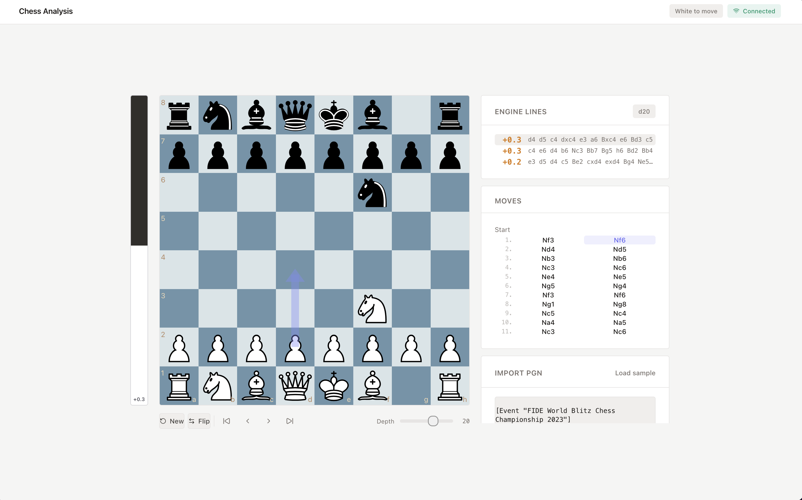
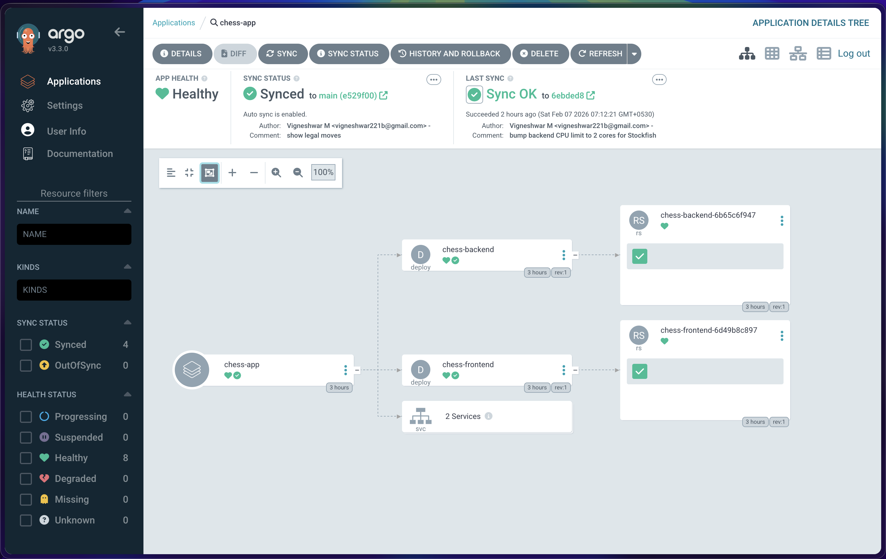
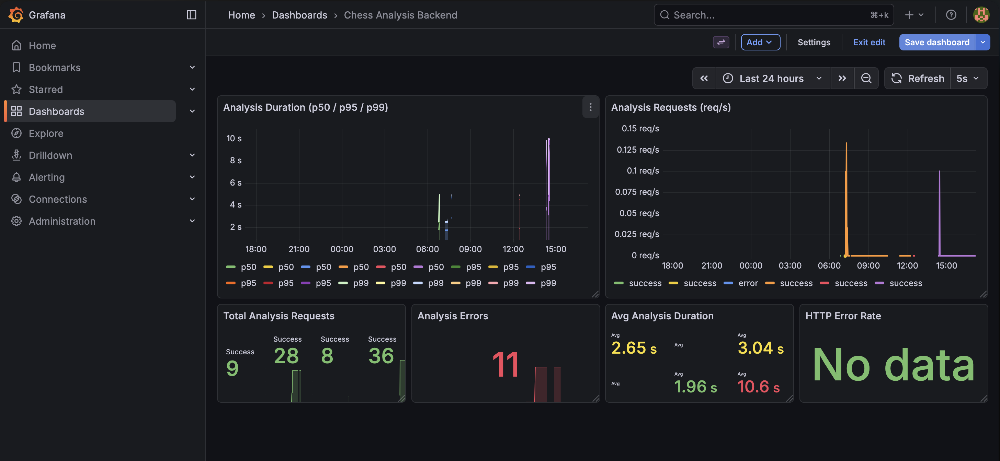

# Chess Analysis Kit

A real-time chess analysis application powered by the Stockfish engine. Play moves on an interactive board and instantly see engine evaluations, top continuation lines, and best move arrows — or import any PGN game to step through and analyze move by move.



## Features

- **Interactive chessboard** with drag-and-drop and click-to-move support
- **Real-time Stockfish analysis** with configurable depth (1–30) and multi-PV lines
- **Evaluation bar** showing advantage with smooth animated transitions
- **PGN import** — paste any PGN to replay and analyze full games
- **Move navigation** with keyboard arrow keys and clickable move list
- **Board controls** — flip orientation, start new game
- **WebSocket communication** for low-latency analysis updates

## Tech Stack

### Frontend
- **React 19** with Vite for fast HMR and optimized production builds
- **Tailwind CSS 4** for utility-first styling
- **react-chessboard** and **chess.js** for board rendering and move validation
- **Socket.IO Client** for real-time WebSocket communication

### Backend
- **Flask** with **Flask-SocketIO** for REST and WebSocket endpoints
- **Stockfish 17** chess engine via subprocess communication
- **python-chess** for FEN validation, PGN parsing, and UCI-to-SAN move conversion
- **Eventlet** for async WebSocket handling

### Infrastructure
- **Docker** — multi-stage frontend build (Node + nginx), backend with Stockfish pre-installed
- **Terraform** — modular IaC using official AWS modules (VPC, EKS, ALB, S3, CloudFront, ElastiCache)
- **AWS EKS** — managed Kubernetes with IRSA for pod-level IAM, ALB for WebSocket traffic
- **S3 + CloudFront** — static frontend hosting with global CDN and SPA routing
- **ElastiCache Redis** — encrypted session store with auth token in Secrets Manager
- **Helm** — parameterized Kubernetes chart under `k8s/chess-app-helm-chart/`
- **ArgoCD** — GitOps continuous delivery with auto-sync and self-heal
- **GitHub Actions** — CI/CD pipeline (build → ECR → S3 → ArgoCD) and manual Terraform workflow



### Observability

- **Prometheus** — metrics collection with custom scrape config for the backend
- **Grafana** — pre-provisioned dashboard with request rates, latency percentiles, analysis duration, and error tracking
- **prometheus_client** — custom metrics (analysis request counter, duration histogram) exposed at `/metrics`
- **Fluent Bit** — DaemonSet log collector → AWS CloudWatch Logs with Kubernetes metadata enrichment
- **Structured JSON logging** — backend emits JSON logs for CloudWatch Insights queries



### Security

- **GitHub OIDC** — keyless CI/CD authentication to AWS (no long-lived IAM keys)
- **IRSA** — pod-level IAM roles for Fluent Bit, ALB Controller, and backend pods
- **SSM Parameter Store** — non-sensitive config; **Secrets Manager** — sensitive values
- **Private subnets** — EKS nodes and Redis in private subnets behind NAT gateway

## Architecture

```
                    +------------------+
                    |     Browser      |
                    +--------+---------+
                             |
              +--------------+--------------+
              |                             |
     CloudFront (CDN)                ALB (sticky sessions)
              |                             |
     +--------+--------+          +--------+-----------+
     |  S3 Bucket       |          |  EKS Backend Pods  |
     |  - React SPA     |          |  (Flask+SocketIO)  |
     |  - Static assets  |          |  - Stockfish       |
     +-----------------+          |  - python-chess    |
                                   +--------+-----------+
                                            |
                                   +--------+-----------+
                                   |  ElastiCache Redis  |
                                   +--------------------+
              |                             |
     +--------+----------------------------+--------+
     |              ArgoCD (GitOps)                  |
     |  auto-sync from main branch                   |
     +-----------------------------------------------+
                          |
     +--------------------+------------------------+
     |           Observability Stack                |
     |  Prometheus + Grafana    ← scrape /metrics   |
     |  Fluent Bit (DaemonSet)  → CloudWatch Logs   |
     +----------------------------------------------+
                          |
     +--------------------+------------------------+
     |           CI/CD (GitHub Actions)             |
     |  push to main → build → ECR → S3 → ArgoCD   |
     |  Terraform → manual trigger                  |
     +----------------------------------------------+
```

## AWS Deployment

### Prerequisites

1. AWS account with CLI configured
2. Create S3 bucket and DynamoDB table for Terraform state:

```bash
aws s3 mb s3://chess-app-terraform-state --region us-east-1
aws s3api put-bucket-versioning --bucket chess-app-terraform-state --versioning-configuration Status=Enabled
aws dynamodb create-table --table-name chess-app-terraform-locks \
  --attribute-definitions AttributeName=LockID,AttributeType=S \
  --key-schema AttributeName=LockID,KeyType=HASH \
  --billing-mode PAY_PER_REQUEST --region us-east-1
```

### Deploy Infrastructure

```bash
cd infrastructure
cp terraform.tfvars.example terraform.tfvars  # edit with your values
terraform init
terraform plan
terraform apply
```

Or trigger the **Terraform** workflow manually from GitHub Actions.

### CI/CD Flow

On every push to `main`:

1. **Build** — Docker images tagged with Git SHA, pushed to ECR
2. **Deploy frontend** — Vite build → S3 sync → CloudFront invalidation
3. **Deploy backend** — Update Helm `values.yaml` with new image tag → commit → ArgoCD auto-syncs to EKS
4. **Verify** — Wait for rollout, health check the ALB endpoint

### GitHub Secrets

| Secret             | Description                                                                       |
|--------------------|-----------------------------------------------------------------------------------|
| `AWS_ROLE_ARN`     | IAM role for CI/CD (`terraform output github_actions_cicd_role_arn`)               |
| `TF_AWS_ROLE_ARN`  | IAM role for Terraform (from `terraform output github_actions_terraform_role_arn`) |

---

## Local Setup

### Prerequisites

| Tool | Purpose |
|------|---------|
| [Docker](https://docs.docker.com/get-docker/) | Build container images |
| [OrbStack](https://orbstack.dev/) (or any local K8s) | Run Kubernetes locally |
| [Helm](https://helm.sh/docs/intro/install/) | Deploy the Helm chart |
| [kubectl](https://kubernetes.io/docs/tasks/tools/) | Interact with the cluster |

### 1. Build Docker Images

```bash
# From the project root
docker build -t chess-frontend:latest ./frontend
docker build -t chess-backend:latest ./backend
```

### 2. Deploy with Helm

```bash
helm install chess-app ./k8s/chess-app-helm-chart
```

Or apply the raw manifests with ArgoCD:

```bash
# Install ArgoCD (one-time)
kubectl create namespace argocd
kubectl apply -n argocd -f https://raw.githubusercontent.com/argoproj/argo-cd/stable/manifests/install.yaml

# Expose ArgoCD UI
kubectl patch svc argocd-server -n argocd -p '{"spec": {"type": "NodePort", "ports": [{"port": 443, "targetPort": 8080, "nodePort": 30443}]}}'

# Deploy the app via ArgoCD
kubectl apply -f k8s/argocd-app.yaml
```

### 3. Deploy Monitoring (Optional)

```bash
# Add Helm repo
helm repo add prometheus-community https://prometheus-community.github.io/helm-charts

# Install Prometheus + Grafana
helm install kube-prometheus prometheus-community/kube-prometheus-stack \
  --namespace monitoring --create-namespace \
  -f k8s/prometheus-values.yaml
```

A pre-built Grafana dashboard is auto-provisioned via ConfigMap when ArgoCD syncs the Helm chart.

### 4. Deploy Logging (Optional)

```bash
# Add Helm repo
helm repo add fluent https://fluent.github.io/helm-charts

# Install Fluent Bit
helm install fluent-bit fluent/fluent-bit \
  --namespace logging --create-namespace \
  -f k8s/fluent-bit-values.yaml
```

Fluent Bit collects container logs as a DaemonSet, enriches them with Kubernetes metadata, and outputs to stdout. Switch to CloudWatch by uncommenting the output block in `k8s/fluent-bit-values.yaml`.

### 5. Access the App

| Service | URL |
|---------|-----|
| Frontend | http://localhost:30080 |
| Backend Health | http://localhost:30501/health |
| ArgoCD UI | https://localhost:30443 |
| Prometheus | http://localhost:30090 |
| Grafana | http://localhost:30300 |

ArgoCD default credentials:
- **Username:** `admin`
- **Password:** `kubectl -n argocd get secret argocd-initial-admin-secret -o jsonpath="{.data.password}" | base64 -d`

Grafana default credentials:
- **Username:** `admin`
- **Password:** `kubectl -n monitoring get secret kube-prometheus-grafana -o jsonpath="{.data.admin-password}" | base64 -d`

### Running Without Kubernetes

If you just want to run the app locally without containers:

```bash
# Backend
cd backend
python -m venv venv && source venv/bin/activate
pip install -r requirements.txt
# Ensure Stockfish is installed: brew install stockfish (macOS)
python app.py

# Frontend (in a separate terminal)
cd frontend
npm install
npm run dev
```

The frontend runs on `http://localhost:5173` and connects to the backend at `http://localhost:5001`.

## Project Structure

```
chess-analysis-kit/
├── frontend/                    # React + Vite
│   ├── src/
│   │   ├── App.jsx              # Main app — board, controls, state
│   │   ├── components/
│   │   │   ├── AnalysisPanel.jsx
│   │   │   ├── EvalBar.jsx
│   │   │   ├── MoveList.jsx
│   │   │   ├── PgnInput.jsx
│   │   │   └── ui/              # Reusable UI primitives
│   │   └── lib/
│   ├── Dockerfile               # Multi-stage: Node build + nginx
│   └── nginx.conf
├── backend/
│   ├── app.py                   # Flask + SocketIO server
│   ├── engine.py                # Stockfish subprocess wrapper
│   ├── config.py                # Engine configuration
│   ├── requirements.txt
│   └── Dockerfile               # Python + Stockfish
├── infrastructure/              # Terraform (AWS)
│   ├── main.tf                  # Root module
│   ├── variables.tf
│   ├── outputs.tf
│   ├── providers.tf             # AWS provider + default tags
│   ├── backend.tf               # S3 remote state + DynamoDB lock
│   ├── vpc.tf                   # VPC, subnets, NAT (terraform-aws-modules/vpc)
│   ├── eks.tf                   # EKS cluster, node groups, IRSA roles
│   ├── ecr.tf                   # ECR repositories + lifecycle policies
│   ├── frontend.tf              # S3 + CloudFront (OAC, SPA routing)
│   ├── alb.tf                   # ALB with sticky sessions for WebSocket
│   ├── redis.tf                 # ElastiCache Redis
│   ├── monitoring.tf            # CloudWatch log groups + Fluent Bit IAM
│   ├── secrets.tf               # SSM Parameter Store + Secrets Manager
│   └── iam.tf                   # GitHub OIDC provider + CI/CD roles
├── k8s/
│   ├── helm-chart/              # Helm chart
│   │   ├── Chart.yaml
│   │   ├── values.yaml
│   │   └── templates/
│   │       ├── backend-deployment.yaml
│   │       ├── backend-service.yaml
│   │       ├── backend-serviceaccount.yaml
│   │       ├── backend-hpa.yaml
│   │       ├── frontend-deployment.yaml
│   │       ├── frontend-service.yaml
│   │       └── grafana-dashboard-cm.yaml
│   ├── argocd-app.yaml          # ArgoCD Application CR
│   ├── prometheus-values.yaml   # Prometheus + Grafana config
│   └── fluent-bit-values.yaml   # Fluent Bit → CloudWatch config
├── .github/workflows/
│   ├── ci-cd.yml                # Build → ECR → S3 → ArgoCD (on push to main)
│   └── terraform.yml            # Plan/Apply/Destroy (manual trigger)
└── README.md
```
